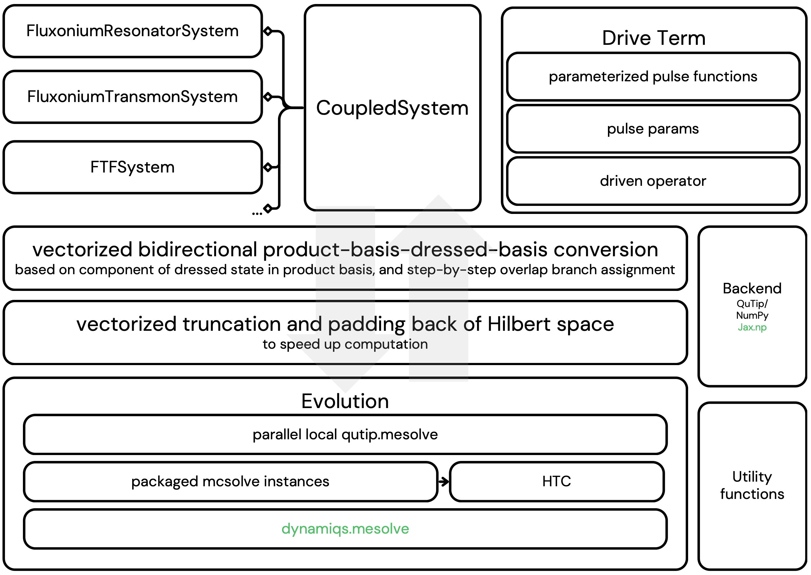

# CoupledQuantumSystems


Quality of life improvements for quantum simulations,
- GPU simulation chekcpointing
- Product basis - dressed basis assignment and fast conversion
- Pulse library that supports qutip, dynamiqs, ScalableSymbolicPulse with qiskit-dynamics
- a lot more
 
```
pip3 install git+https://github.com/JiakaiW/CoupledQuantumSystems
```

to use it with dynamiqs, I recommand using the requirements.lock (without those strict versions I sometimes see very low level errors from gpu dynamiqs.mesolve)
'''
pip install --upgrade pip
pip install -r requirements.lock \
            -c requirements.lock      # lock file wins
pip install .[jax]                    # project deps obey the constraints
'''


